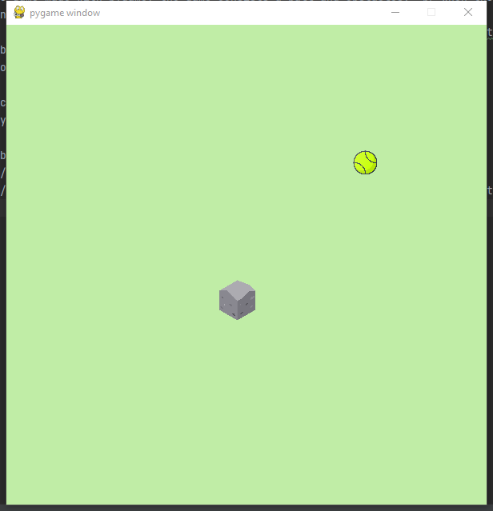

# Bouncing Ball Game

This is a simple game made with pygame, the game consists a ball and obstacles.  When the game starts running, a ball
will start moving randomly.  
When the player left click on the screen, an obstacle would show up, and if the player right click on the obstacle, it
would vanish.  
The ball will bounce every time when it hits the wall or the obstacles. 

In order to execute the game: 
 * make sure you have python 3.0 or above 
 * pygame need to be installed 
 * just run main.py 

Demostration: 

Image sources: 
<a href="https://www.flaticon.com/free-icons/rock" title="rock icons">Rock icons created by Freepik - Flaticon</a> 
<a href="https://www.flaticon.com/free-icons/tennis" title="tennis icons">Tennis icons created by Those Icons -
Flaticon</a>